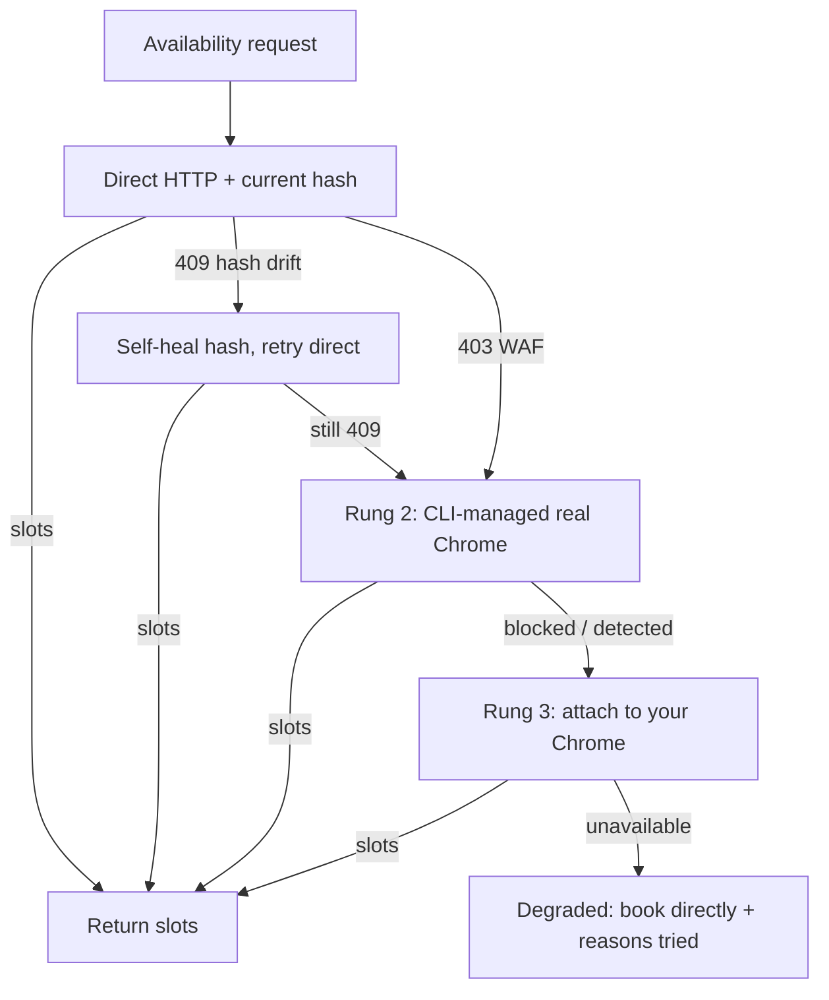

# OpenTable Availability Reliability

## Summary

Make OpenTable live availability actually return slots in a fork of `table-reservation-goat`. Two parts: self-heal the stale-hash 409 by scraping and caching a fresh `RestaurantsAvailability` persisted-query hash on failure, and route around the Akamai WAF 403 through a graceful-degradation ladder (direct HTTP → real Chrome → attach-to-your-Chrome). The browser rung is gated behind a spike that proves a CLI-launched headful Chrome can pass Akamai before we build it; if the spike fails, the ladder collapses to the already-proven attach-to-your-Chrome path.

---

## Problem Frame

OpenTable availability fails two distinct ways, and they are not the same problem.

The **409** is persisted-query hash drift. The client sends a SHA-256 hash instead of the query text; OpenTable's Apollo gateway maps it to a registered query. That hash rotates on frontend bundle releases. The hardcoded `RestaurantsAvailabilityHash` was captured May 2026 and has since drifted, so the gateway rejects it with a 409 — even though the request cleared the WAF. Live testing on 2026-07-06 hit this on both `availability check` and `earliest`.

The **403** is the Akamai WAF, already analyzed in the 2026-05-09 `ot-akamai-waf-resilience` brainstorm: a probabilistic rule keyed on `(IP, session, opname)` that blocks `RestaurantsAvailability` for non-real-browser traffic and escalates under rapid-fire calls. That prior work shipped a mitigation stack — disk cache, singleflight, adaptive limiter, two-attempt retry, stale-cache fallback, `HTTPS_PROXY` — so a human-pace user rarely escalates.

Two gaps remain after that prior work. First, nothing fixes the 409 — the `--refresh-hashes` escape hatch is referenced in code comments and error hints but was never built. Second, the WAF mitigation degrades to a "venue exists, book directly" message on a cold cache when Akamai blocks; the only reliable recovery is a real browser, and today that requires the user to manually launch Chrome with a debug port. The browser fallback also never engages on the error we hit most, because it is gated on 403 bot-detection and the live failure is a 409.

---

## Key Decisions

- **The 409 self-heal is the primary, standalone win.** It is genuinely unbuilt, aligned with the author's design, and delivers value even if all browser work slips. Sequence it first.
- **The browser path is primary-when-needed, not a pure 403 fallback.** The direct HTTP path cannot beat the intermittent WAF on its own; real reliability needs a real browser in the loop for the blocked case. The Chrome-page-XHR route also carries the page's live hash, so it sidesteps the 409 as a side effect.
- **Spike the managed-Chrome rung before building it.** The code proves only that a *user's own attached* Chrome passes Akamai; a *CLI-launched headful* Chrome is unproven. Build a throwaway that launches a managed headful Chrome and drives a real availability call. Pass → build the full ladder. Fail → ship the attach-only version.
- **A resident browser daemon diverges from the author's stated product identity.** The 2026-05-09 brainstorm explicitly rejected "a long-running daemon to keep a Chrome session warm" as off-identity for a self-contained executable. A managed persistent-profile Chrome is a deliberate fork-only divergence — acceptable because this ships to a personal fork first, but it is the main obstacle to upstreaming and must be gated/opt-in if it goes upstream.
- **Refreshing the hash must invalidate the availability cache.** The prior brainstorm flagged that cached responses are tied to a schema/hash version; a hash rotation that isn't paired with cache invalidation would serve responses shaped for the old query. The 409 self-heal and the existing cache are coupled.

---

## Requirements

**Hash self-heal (the 409)**

- R1. On a `RestaurantsAvailability` 409 (Apollo persisted-query mismatch) or a `PERSISTED_QUERY_NOT_FOUND` 400, the client fetches a fresh OpenTable page, extracts the current `RestaurantsAvailability` persisted-query hash, caches it, and retries the call once with the fresh hash.
- R2. The freshly scraped hash persists across invocations (so the scrape cost is paid once per rotation, not once per call) and takes precedence over the hardcoded constant when present.
- R3. A refreshed hash invalidates availability cache entries written under the prior hash, so no response shaped for the old query is served after a rotation.
- R4. A manual refresh entry point exists (e.g., `doctor --refresh-hashes` or equivalent) so a user can force a re-scrape without waiting for a failure.
- R5. If the scrape cannot find a hash, the CLI surfaces a clear, actionable error rather than looping or failing silently.

**WAF degradation ladder (the 403)**

- R6. The availability path attempts, in order, stopping at the first that returns slots: (1) direct HTTP with the self-healed hash, (2) a CLI-managed real Chrome driving the page's own availability request, (3) attach to a user's already-running Chrome via the debug URL.
- R7. The browser fallback triggers on both the 403 bot-detection case and the 409 hash-drift case — not only on 403 as it does today.
- R8. Rung 3 (attach-to-your-Chrome) works whether or not rung 2 ships; it is the proven floor and the fallback when the rung-2 spike fails.
- R9. When every rung fails, the CLI returns the existing "venue exists, book directly" degraded response with a reason that names which rungs were tried and why each failed.

**Behavior and surface**

- R10. `availability check` gets the same laddered path as `earliest` — today only `earliest` reaches the Chrome fallback, so a direct `availability check` surfaces the raw 409.
- R11. The new behavior stays agent-safe: non-interactive, `--agent`/JSON output unchanged in shape, no new interactive prompt on the default path.

---

## Key Flows

- F1. Availability request with laddered recovery
  - **Trigger:** Any availability call (`availability check`, `earliest`, `goat` slot enrichment) for an OpenTable venue.
  - **Steps:** Try direct HTTP with the current hash. On 409, self-heal the hash (R1) and retry direct. On a still-failing 409 or a 403, fall to rung 2 (managed Chrome). On rung-2 failure, fall to rung 3 (attach-to-your-Chrome). On total failure, return the degraded book-directly response naming what was tried.
  - **Outcome:** Slots when any rung succeeds; a clear multi-rung failure reason otherwise.
  - **Covered by:** R1, R6, R7, R8, R9, R10

---

## Acceptance Examples

- AE1. **Covers R1, R2.** Given the hardcoded hash is stale, when the user runs `availability check <id> --date <d> --party 2` and the gateway returns 409, the CLI scrapes a fresh hash, retries, and returns slot data. A second call within the same session reuses the persisted fresh hash and does not re-scrape.
- AE2. **Covers R3.** Given a cached availability response exists under the old hash, when a hash refresh occurs, the stale-hash cache entry is not served; the next read reflects the current query shape.
- AE3. **Covers R7, R10.** Given a direct `availability check` returns 409, the browser ladder engages (today it does not, because the fallback is 403-only and `availability check` never reaches it).
- AE4. **Covers R8.** Given the rung-2 spike proved unviable and rung 2 is disabled, when direct HTTP is WAF-blocked and the user has Chrome running on the debug port, the CLI returns slots via rung 3.
- AE5. **Covers R9.** Given all rungs fail, the response names each rung tried and its failure reason, not a generic error.

---

## Scope Boundaries

**Deferred for later**
- The upstream `/printing-press-amend` PR. Fork-first; sharing is a later decision, and the managed-Chrome rung would need opt-in gating before it could be proposed upstream.
- Booking/cancel hash refresh. The same scrape machinery could refresh the stale `BookingConfirmationHash`/`CancelReservationHash`, but this brainstorm is scoped to availability reads. Note it as adjacent follow-on.

**Outside this scope**
- Rebuilding the 403 mitigation stack. The cache, singleflight, adaptive limiter, retry, stale-cache fallback, and `HTTPS_PROXY` already exist from the 2026-05-09 work; this builds on them, it does not replace them.
- Resy and Tock paths. Both already return live availability and booking; untouched.
- Beating Akamai's detection of *spawned headless* Chrome via stealth patches. The code already documents that headless spawn is detected; the strategy here is a real headful browser, not a stealthier headless one.

---

## Dependencies / Assumptions

- The SSR extraction path (`FetchInitialState` in `internal/source/opentable/ssr.go`) can reach the page markup that carries the current `RestaurantsAvailability` hash. Assumption — the exact location of the hash in the current bundle must be confirmed during the spike; if it is not in `__INITIAL_STATE__`, the scrape needs a different anchor.
- A CLI-launched headful Chrome (real window, persistent profile) passes Akamai where spawned headless does not. Unverified assumption — this is the rung-2 spike's job. Only attach-to-existing-Chrome is proven today.
- The existing availability cache is keyed such that a hash-version dimension can be added for R3. Confirm against `internal/source/opentable/avail_cache.go`.
- `BotDetectionError` / `IsBotDetection` remain the signal for the 403 branch; R7 adds a 409 branch alongside it rather than reclassifying the 409 as bot-detection.

---

## Outstanding Questions

### Resolve Before Planning
- Does the rung-2 spike pass? This gates whether the plan builds the full ladder (R6 all three rungs) or the attach-only floor (R8 + R1 self-heal). Run the spike first; the plan branches on the result.

### Deferred to Planning
- [Affects R2, R4] Where does the refreshed hash persist and under what config surface — reuse the session/config file, or a dedicated hash cache? Pick names consistent with the existing `TABLE_RESERVATION_GOAT_OT_*` and `TRG_*` conventions.
- [Affects R6] Should rung 2 be gated behind a flag/env even in the fork (default off, opt-in), or default-on because it degrades safely? Decide at plan time; leans opt-in for upstream-friendliness.
- [Affects R2] How is a scraped hash decided to be current vs itself stale — trust the freshly scraped value unconditionally, or validate with a probe call before persisting?

---

## Sources / Research

- `docs/brainstorms/2026-05-09-ot-akamai-waf-resilience-requirements.md` — the author's prior WAF analysis and the shipped mitigation stack; the no-daemon identity decision lives here.
- `internal/source/opentable/client.go` — `RestaurantsAvailabilityHash` constant (~line 63), the 409/persisted-query error surfacing (~lines 685-810), `gqlCall`, and `RefreshAkamaiCookies` usage (~line 111).
- `internal/source/opentable/chrome_avail.go` — the Chrome-page-XHR interception path and the documented finding that spawned headless is detected while attached real Chrome passes.
- `internal/source/opentable/cooldown.go` — `BotDetectionError`, `BotKindOperationBlocked`, and the operation-specific vs session-wide distinction.
- `internal/source/opentable/ssr.go` — `FetchInitialState`, the SSR extraction machinery the hash scrape would reuse.
- `internal/cli/earliest.go` — the `IsBotDetection`-gated Chrome fallback (~line 788) that R7 extends to fire on 409.
