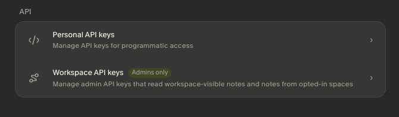
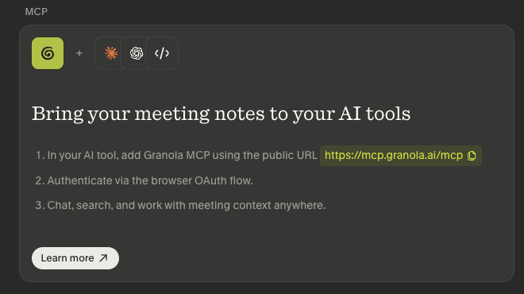

<!-- // PATCH(skill-doc-auth-rewrite): Auth Setup section rewritten for the
     public REST + official-MCP model. Granola v7.4x+ sealed cache-v6.json.enc
     behind its own Keychain access group, so the CLI now sources data from the
     public REST API (GRANOLA_API_KEY, required) plus Granola's official MCP
     (mcp-auth login, optional — private/human notes only). -->

# Granola — Printing Press CLI

## Prerequisites: Install the CLI

This skill drives the `granola-pp-cli` binary. **You must verify the CLI is installed before invoking any command from this skill.** If it is missing, install it first:

1. Install via the Printing Press installer. It defaults binaries to `$HOME/.local/bin` on macOS/Linux and `%LOCALAPPDATA%\Programs\PrintingPress\bin` on Windows:
   ```bash
   npx -y @mvanhorn/printing-press-library install granola --cli-only
   ```
2. Verify: `granola-pp-cli --version`
3. Ensure the reported install directory is on `$PATH` for the agent/runtime that will invoke this skill.

If the `npx` install fails (no Node, offline, etc.), fall back to a direct Go install (requires Go 1.26.5 or newer). This installs into `$GOPATH/bin` (default `$HOME/go/bin`), so add that directory to `$PATH` instead:

```bash
go install github.com/mvanhorn/printing-press-library/library/productivity/granola/cmd/granola-pp-cli@latest
```

If `--version` reports "command not found" after install, the runtime cannot see the binary directory on `$PATH`. Do not proceed with skill commands until verification succeeds.

## When to Use This CLI

Reach for granola-pp-cli when you need to answer cross-meeting questions Granola.ai’s web app and the GUI cannot — attendee timelines, MEMO pipeline state, recipes coverage gaps, calendar overlay, talk-time aggregation. It is the right tool for an agent processing transcripts in a loop, a CSM doing pre-call prep, or a consultant running a weekly retro. Pair the --json default with --select dotted paths to keep agent context lean.

## When Not to Use This CLI

Do not activate this CLI for requests that require creating, updating, deleting, publishing, commenting, upvoting, inviting, ordering, sending messages, booking, purchasing, or changing remote state. This printed CLI exposes read-only commands for inspection, export, sync, and analysis.

## Platform Notes

`warm <id> <query>` drives the Granola desktop GUI via AppleScript and is **macOS-only**. It prints what it would do by default; pass `--launch` to actually activate the app. On non-macOS hosts the command exits 0 with a "not supported" message. All other commands are cross-platform.

## Unique Capabilities

These capabilities aren't available in any other tool for this API.

### MEMO pipeline
- **`memo run`** — Run the preflight → extract pipeline on one meeting or every new meeting since a timestamp, emitting the MEMO three-file artifact and an ndjson run-state ledger.

  _Replaces the per-meeting shell loop that drives the MEMO pipeline — one call, one ndjson stream, agent-readable._

  ```bash
  granola-pp-cli memo run --since 24h --to ~/Documents/Dev/meeting-transcripts --json
  ```
- **`memo queue`** — List every meeting whose transcript is in the cache but whose MEMO triple is not yet on disk.

  _Answers the daily question “what’s still un-MEMO’d?” without the user opening Granola at all._

  ```bash
  granola-pp-cli memo queue --since 7d --json
  ```

### Attendee intelligence
- **`attendee timeline`** — Every meeting with a given attendee, ordered oldest→newest, with title, date, folder, and recipe-applied flag per row.

  _Pre-call prep in one command; surfaces the conversation arc with a single person across months of meetings._

  ```bash
  granola-pp-cli attendee timeline alice@example.com --since 60d --json --select id,title,started_at,folder,recipes
  ```
- **`attendee brief`** — Pulls the last N meetings with an attendee and stitches together their real cached notes plus real AI panel summaries — no synthesis.

  _Eliminates the click-each-meeting copy-paste that account leads do before every external call._

  ```bash
  granola-pp-cli attendee brief alice@example.com --last 3 --panel action-items --json
  ```

### Folders + recipes
- **`folder stream`** — ndjson stream of every meeting in a Granola folder (resolved via documentLists + listRules) with notes and a named panel inlined.

  _Replaces the weekly retro workflow of opening a folder and copy-pasting each meeting’s summary into a spreadsheet._

  ```bash
  granola-pp-cli folder stream client-foo --panel summary --json
  ```
- **`recipes coverage`** — Surface meetings that did NOT have a named panel template/recipe applied within a date range.

  _Friday retro question “did I run the Discovery recipe on every new-prospect call?” answered in one row per gap._

  ```bash
  granola-pp-cli recipes coverage discovery --since 14d --json
  ```

### Transcript analytics
- **`talktime`** — Per-segment-source talk-time for one meeting — microphone (you) vs system (everyone else) in minutes.

  _Confidence column lets you grade transcript accuracy; mic vs system split is the input to “am I talking too much” retros._

  ```bash
  granola-pp-cli talktime 196037d9 --json
  ```
- **`talktime`** — Lifts the per-source talk-time aggregation across N meetings since a date — who-talked-most over time.

  _Time-defrag retro input that no per-meeting tool can produce._

  ```bash
  granola-pp-cli talktime --by participant --since 7d --json
  ```

### Cache-native data
- **`chat list`** — List and dump Granola’s AI chat threads anchored to a meeting (entities.chat_thread + entities.chat_message in the cache).

  _Recovers the AI Q&A history a user has accumulated against a meeting — useful when chasing what you asked about an account weeks ago._

  ```bash
  granola-pp-cli chat list 196037d9 --json
  ```
- **`calendar overlay`** — Left-anti-join meetingsMetadata calendar events with documents.google_calendar_event to find calendared-but-not-recorded meetings.

  _Sarah’s Friday retro and Damien’s “what did I miss” sweep both reduce to this row-level diff._

  ```bash
  granola-pp-cli calendar overlay --week 2026-05-11 --missed-only --json
  ```

### Pipeline hygiene
- **`duplicates scan`** — Hash (title, date-bucket, attendee-email-set) across the cache and a meeting-transcripts repo to surface duplicates at scale.

  _Repos accumulate near-duplicate files when meetings are re-extracted; this returns the dupe groups for cleanup._

  ```bash
  granola-pp-cli duplicates scan --root ~/Documents/Dev/meeting-transcripts --json
  ```
- **`tiptap extract`** — Render documents[id].notes (TipTap JSON: headings, bullet_list, list_item, bold marks, paragraph_break) to canonical markdown instead of falling back to notes_plain.

  _The MEMO summary file’s quality is bounded by extractor fidelity; granola.py loses sub-list hierarchy and bold runs._

  ```bash
  granola-pp-cli tiptap extract 196037d9 --as markdown
  ```

## Command Reference

This CLI exposes 35+ commands. The full tree is too long to inline; ask the CLI for the canonical list:

```bash
granola-pp-cli --help                              # top-level commands
granola-pp-cli <command> --help                    # subcommands + flags
granola-pp-cli agent-context --json                # machine-readable command tree for agents
```

Quick orientation by group:

| Group | Commands | Purpose |
|-------|----------|---------|
| **MEMO pipeline** | `memo run`, `memo queue`, `preflight`, `extract` | Composed three-stream pipeline; reads cache + writes MEMO triple |
| **Meetings** | `meetings list`, `meetings get`, `meetings fetch-batch`, `meetings delete`, `meetings restore`, `show` | List/inspect/mutate meetings (delete/restore mutate via the public REST API) |
| **Streams** | `notes-show`, `panel get`, `transcript get`, `tiptap extract` | The three streams — human notes, AI panels, transcript — addressable separately |
| **Export** | `export`, `export-all` | Combined three-stream markdown export, single or bulk |
| **Cross-meeting analytics** | `attendee timeline`, `attendee brief`, `folder stream`, `recipes coverage`, `talktime`, `calendar overlay`, `stats frequency`, `stats duration`, `stats attendees`, `stats calendar`, `collect`, `duplicates scan`, `chat list`, `chat get` | Queries no per-meeting tool can answer |
| **Folders / recipes / workspaces** | `folders` (public-API), `folder list`, `folder stream`, `recipes list`, `recipes describe`, `recipes coverage`, `workspaces list` | Granola organizational entities |
| **Public-API mirrors** | `notes list`, `notes get`, `folders` | Typed Bearer-key endpoints |
| **Sync / system** | `sync`, `enrich`, `sync-api`, `mcp-auth login / status / verify / logout`, `doctor`, `auth login`, `auth status`, `auth set-token`, `auth logout`, `which`, `agent-context`, `version`, `import` | REST-driven store hydration + enrichment, Granola-MCP connection, auth, capability discovery, batch import |
| **GUI bridge** | `warm` (macOS only) | Drives Granola desktop app via AppleScript |

Three commands anchor the REST + MCP model:

- **`sync`** — one command to populate the local SQLite store from the public REST API (meeting list + folders), enriching meetings/transcripts/attendees from the per-meeting detail endpoint; also pulls private notes when Granola's MCP is connected. `--full` enriches the entire library (default: 50 most recent).
- **`enrich [--limit N | --full]`** — the detail/transcript/notes enrichment step alone. `sync` runs it for you; call it directly to refresh more meetings (`--full` for the whole library).
- **`mcp-auth login | status | verify | logout`** — connect and inspect Granola's official MCP for private/human notes. `verify` confirms those notes are reachable end-to-end.

### Finding the right command

When you know what you want to do but not which command does it, ask the CLI directly:

```bash
granola-pp-cli which "<capability in your own words>"
```

`which` resolves a natural-language capability query to the best matching command from this CLI's curated feature index. Exit code `0` means at least one match; exit code `2` means no confident match — fall back to `--help` or use a narrower query.

## Recipes


### Daily MEMO loop

```bash
granola-pp-cli memo run --since 24h --to ~/Documents/Dev/meeting-transcripts --json
```

Process every new meeting since yesterday into the MEMO triple format and yield only the new artifacts.

### Pre-call attendee brief

```bash
granola-pp-cli attendee brief alice@example.com --last 3 --panel action-items --json --select meetings.title,meetings.started_at,panels.action_items
```

Pull the last three meetings with Trevin and only the title, date, and action-items panel content per meeting.

### Friday retro — missing recipes

```bash
granola-pp-cli recipes coverage discovery --since 14d --json
```

Surface every new-prospect call in the last fortnight that did not have the Discovery panel applied. Omit the slug to list coverage gaps across every panel template.

### Repo-wide duplicate scrub

```bash
granola-pp-cli duplicates scan --root ~/Documents/Dev/meeting-transcripts --json
```

Find duplicate-meeting clusters across the MEMO output repo for cleanup.

### Calendar-overlay missed-meeting sweep

```bash
granola-pp-cli calendar overlay --week 2026-05-11 --missed-only --json
```

Calendared meetings with no Granola recording — weekly accountability check.

## Auth Setup

Two surfaces. The public REST API key is required and powers everything; Granola's official MCP is optional and only supplies your private/human notes.

1. **`GRANOLA_API_KEY` — public REST API (required).** Powers `sync`, meetings, transcripts, summaries, folders, attendees, talk-time, search, and the MEMO pipeline's transcript + summary. Get it from **Granola Settings → API** — a **Personal** key (your notes) or a **Workspace** key (workspace-visible notes) both work identically. Set it:

   ```bash
   export GRANOLA_API_KEY=<your-key>
   ```

   

   *Granola Settings → API. A Personal or a Workspace key both work — the CLI treats them identically.*

2. **Granola's official MCP — private/human notes (optional, additive).** The REST API omits your raw private/human notes; Granola's official MCP server (`https://mcp.granola.ai`) is the only source for them. Everything else works without it — the commands that show human notes (`notes-show`, `memo`, `extract`, `export`) just omit the human-notes section until you connect. Connect once, then verify:

   ```bash
   granola-pp-cli mcp-auth login     # browser OAuth (PKCE); tokens saved to the macOS Keychain, never on disk
   granola-pp-cli mcp-auth status    # is it connected?
   granola-pp-cli mcp-auth verify    # confirm private notes are reachable end-to-end
   ```

   

   *Granola's official MCP setup. `mcp-auth login` connects the CLI to `mcp.granola.ai` as an OAuth client to fetch the private notes REST omits.*

3. **Two different MCP servers — keep them distinct.** This CLI *exposes its own* MCP server (`granola-pp-mcp`, the agent-native surface that mirrors its commands as tools — see "MCP Server Installation" below) **and** separately *consumes Granola's official* MCP server (`mcp.granola.ai`, an external service run by Granola) as an OAuth client for private notes. `mcp-auth` connects the latter; it has nothing to do with the former.

4. **The sealed desktop store is unused.** On Granola v7.4x+ the local store (`~/Library/Application Support/Granola/cache-v6.json.enc`) and the internal API token sit behind Granola's own macOS Keychain access group, so no third-party binary can decrypt them. The CLI does not try — all data flows through the public REST API and the official MCP instead.

Run `granola-pp-cli doctor` to verify setup: it makes a real REST call to confirm the key, reports whether Granola's MCP is connected, and reports the sealed desktop store as **app-private** (INFO, not an error).

### Troubleshooting

| `doctor` says... | What to do |
|---|---|
| `INFO desktop store app-private on Granola v7.4x+ (using public REST API + official MCP)` | Expected, not an error. Granola sealed `cache-v6.json.enc` behind its own Keychain access group. Run `granola-pp-cli sync` to populate the store from the REST API; run `granola-pp-cli mcp-auth login` to add private notes. |
| `auth: not configured` (hint `export GRANOLA_API_KEY=<your-key>`) | Set `GRANOLA_API_KEY` from Granola Settings → API (Personal or Workspace). The key powers `sync` and every data command. |
| `api: reachable` + `auth: ok` | REST is wired up. `sync` will hydrate the local store; row counts and freshness show in `--json` output. |
| `granola_mcp: connected (private/human notes available)` | Granola's official MCP is connected — human notes will appear in `notes-show`, `memo`, `extract`, `export`. |
| `granola_mcp: not connected` | Optional. Private/human notes are omitted until you run `granola-pp-cli mcp-auth login`, then `granola-pp-cli mcp-auth verify`. |

## Agent Mode

Add `--agent` to any command. Expands to: `--json --compact --no-input --no-color --yes`.

- **Pipeable** — JSON on stdout, errors on stderr
- **Filterable** — `--select` keeps a subset of fields. Dotted paths descend into nested structures; arrays traverse element-wise. Critical for keeping context small on verbose APIs:

  ```bash
  granola-pp-cli folders --agent --select id,name,status
  ```
- **Previewable** — `--dry-run` shows the request without sending
- **Offline-friendly** — `sync` and the `meetings list --query <text>` FTS path use the local SQLite store
- **Non-interactive** — never prompts, every input is a flag
- **Mostly read-only** — `meetings delete`, `meetings restore`, `import`, and `warm --launch` are the only commands that mutate state; every other command inspects, exports, syncs, or analyzes

### Response envelope

Commands that read from the local store or the API wrap output in a provenance envelope:

```json
{
  "meta": {"source": "live" | "local", "synced_at": "...", "reason": "..."},
  "results": <data>
}
```

Parse `.results` for data and `.meta.source` to know whether it's live or local. A human-readable `N results (live)` summary is printed to stderr only when stdout is a terminal — piped/agent consumers get pure JSON on stdout.

## Auto-Refresh

Every command auto-refreshes the local store as its first action. You do **not** need to run `granola-pp-cli sync` before `meetings list`, `panel get`, or any other read — the CLI handles that for you on every invocation.

**Where it refreshes from:**

| Surface | What runs | When it fires |
|---------|-----------|---------------|
| Public REST API | `sync-api` (public-api.granola.ai → SQLite) + per-meeting detail enrichment | When `GRANOLA_API_KEY` is set |
| Granola's official MCP | private/human notes pulled into the store | When Granola's MCP is connected (`mcp-auth login`) |
| Desktop encrypted cache | no-op | Sealed (app-private) on Granola v7.4x+ — the CLI does not read it |

When `GRANOLA_API_KEY` is not configured, auto-refresh is a silent no-op and your underlying command produces its own auth error.

**Freshness ceiling.** Auto-refresh reads from Granola's public REST API (and the official MCP for private notes); it does **not** poke the desktop app. The freshness ceiling is whatever Granola has published to your account through the REST API and MCP.

**Provenance line.** When stderr is a TTY and you are not in `--agent` / `--json` / `--compact` / `--quiet` mode, a one-liner like `auto-refresh: api=ok (1.2s, 47 rows)` lands on stderr after the refresh. Agent and JSON consumers see no chatter on stdout.

**Failures are non-fatal.** A refresh that fails prints `api=failed: <short reason>` on stderr and the command proceeds against whatever data is already in the store. Run `granola-pp-cli doctor` to investigate persistent refresh failures.

**Opt out** (precedence: flag wins over env):

```bash
# Single command:
granola-pp-cli meetings list --no-refresh

# For a shell session / CI job:
export GRANOLA_NO_AUTO_REFRESH=1

# Saved per-profile via the existing profile mechanism:
granola-pp-cli profile save fast --no-refresh
granola-pp-cli --profile fast meetings list
```

**Skipped commands.** Auto-refresh never fires for `sync`, `sync-api`, `auth*`, `doctor`, `help`, `version`, `completion`, `agent-context`, `profile*`, `feedback*`, or `which`. These either do not read data or cannot operate before auth is established. `agent-context --json` exposes the full skip list under `auto_refresh.skip_list` for introspecting agents.

## Agent Feedback

When you (or the agent) notice something off about this CLI, record it:

```
granola-pp-cli feedback "the --since flag is inclusive but docs say exclusive"
granola-pp-cli feedback --stdin < notes.txt
granola-pp-cli feedback list --json --limit 10
```

Entries are stored locally at `~/.granola-pp-cli/feedback.jsonl`. They are never POSTed unless `GRANOLA_FEEDBACK_ENDPOINT` is set AND either `--send` is passed or `GRANOLA_FEEDBACK_AUTO_SEND=true`. Default behavior is local-only.

Write what *surprised* you, not a bug report. Short, specific, one line: that is the part that compounds.

## Output Delivery

Every command accepts `--deliver <sink>`. The output goes to the named sink in addition to (or instead of) stdout, so agents can route command results without hand-piping. Three sinks are supported:

| Sink | Effect |
|------|--------|
| `stdout` | Default; write to stdout only |
| `file:<path>` | Atomically write output to `<path>` (tmp + rename) |
| `webhook:<url>` | POST the output body to the URL (`application/json` or `application/x-ndjson` when `--compact`) |

Unknown schemes are refused with a structured error naming the supported set. Webhook failures return non-zero and log the URL + HTTP status on stderr.

## Named Profiles

A profile is a saved set of flag values, reused across invocations. Use it when a scheduled agent calls the same command every run with the same configuration - HeyGen's "Beacon" pattern.

```
granola-pp-cli profile save briefing --json
granola-pp-cli --profile briefing folders
granola-pp-cli profile list --json
granola-pp-cli profile show briefing
granola-pp-cli profile delete briefing --yes
```

Explicit flags always win over profile values; profile values win over defaults. `agent-context` lists all available profiles under `available_profiles` so introspecting agents discover them at runtime.

## Exit Codes

| Code | Meaning |
|------|---------|
| 0 | Success |
| 2 | Usage error (wrong arguments) |
| 3 | Resource not found |
| 4 | Authentication required |
| 5 | API error (upstream issue) |
| 7 | Rate limited (wait and retry) |
| 10 | Config error |

## Argument Parsing

Parse `$ARGUMENTS`:

1. **Empty, `help`, or `--help`** → show `granola-pp-cli --help` output
2. **Starts with `install`** → ends with `mcp` → MCP installation; otherwise → see Prerequisites above
3. **Anything else** → Direct Use (execute as CLI command with `--agent`)

## MCP Server Installation

Install the MCP binary from this CLI's published public-library entry or pre-built release, then register it:

```bash
claude mcp add granola-pp-mcp -- granola-pp-mcp
```

Verify: `claude mcp list`

## Direct Use

1. Check if installed: `which granola-pp-cli`
   If not found, offer to install (see Prerequisites at the top of this skill).
2. Match the user query to the best command from the Unique Capabilities and Command Reference above.
3. Execute with the `--agent` flag:
   ```bash
   granola-pp-cli <command> [subcommand] [args] --agent
   ```
4. If ambiguous, drill into subcommand help: `granola-pp-cli <command> --help`.
